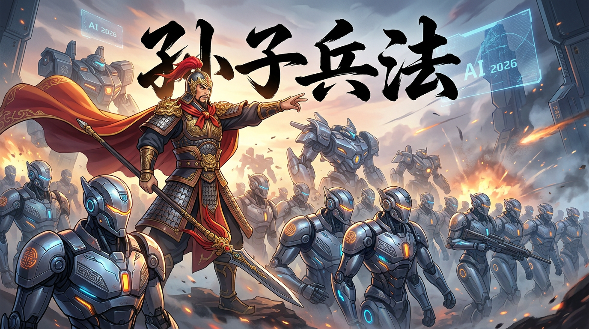

# 孙子兵法商业参谋

<div align="center">



**把春秋战场的胜负手，变成AI的商业诊断书。**

适用于 ChatGPT · Claude · Cursor · Coze · WorkBuddy · 所有AI工具

[](#免责声明)
[](https://github.com/ansuelele/sunzi-strategist)

</div>

---

## 是什么

一个以孙武《孙子兵法》为框架的 AI 战略参谋 Skill。

激活后，AI 会以孙武的战略视角分析你的商业处境，提供基于"五事七计"的理性评估 + 基于"伐谋伐交伐兵"的策略选项 + 基于原文智慧的行动建议。

**不是给你讲历史故事，是帮你用2000年前的战略智慧解决今天的商业问题。**

---

## 核心技能

| 技能 | 输入 | 输出 |
|------|------|------|
| **竞品战略分析** | 竞品动态、竞争格局 | 五事七计分析 + 可用弱点 + 应对优先级 |
| **商业谈判策略** | 谈判对象、筹码、担忧 | 伐谋方案 + 伐兵底线 + 让步策略 |
| **市场进入判断** | 目标市场、竞争格局 | 地形判断 + 奇正策略 + 时机建议 |
| **团队管理诊断** | 团队问题、领导困境 | 将之五危分析 + 治气方法 |
| **危机决策参谋** | 危机类型、当前处境 | 死地求生策略 + 冷静决策框架 |
| **个人战略规划** | 职业困境、转型选择 | 五事自评 + 先胜后战路径 |

---

## 三大核心原则

> **全胜思想** — "百战百胜，非善之善者也；不战而屈人之兵，善之善者也。"
> 最高明的胜利是不战而胜。谈判优于对抗，围堵优于交火。

> **先胜后战** — "善战者，先为不可胜，以待敌之可胜。"
> 先确保自己立于不败之地，再等待对手露出破绽。

> **致人而不致于人** — 掌握主动权。调动对手，不被对手调动。

---

## 战略分析框架

### 五事七计

评估任何竞争格局的标准工具：

| 五事 | 评估维度 | 七计对比 |
|------|---------|---------|
| **道** | 方向认同（团队/用户/伙伴是否认同你的使命） | 主孰有道 |
| **天** | 时机窗口（宏观趋势、季节、政策是否站在你这边） | 天地孰得 |
| **地** | 位置优势（你在哪个细分市场有地理/生态位优势） | 天地孰得 |
| **将** | 领导力（你的团队有没有能打硬仗的将领） | 将孰有能 |
| **法** | 制度执行（你的流程、激励、复盘机制是否健全） | 法令孰行 / 赏罚孰明 |

### 战略优先级

```
上兵伐谋    → 通过战略布局让对手主动放弃
其次伐交    → 联合第三方孤立对手
其次伐兵    → 展示实力，形成威慑
其下攻城    → 正面硬刚（代价最高，尽量避免）
```

### 将之五危

领导者的五种致命弱点（分析对手，也自检）：

| 五危 | 表现 | 可利用性 |
|------|------|---------|
| 必死 | 硬拼送死 | 对手敢死 → 诱敌深入 |
| 必生 | 贪生怕死 | 对手怕死 → 恐吓有效 |
| 忿速 | 急躁易怒 | 对手冲动 → 激怒后犯错 |
| 廉洁 | 过于自尊 | 对手要面子 → 捧杀有效 |
| 爱民 | 心软被动 | 对手心软 → 利用其负担 |

---

## 使用方法

### 方法一：WorkBuddy（推荐）

```bash
git clone https://github.com/ansuelele/sunzi-strategist.git ~/.workbuddy/skills/sunzi-strategist
```

然后在 WorkBuddy 中说：
```
用孙子视角分析：竞品刚发了一个打价格战的产品，我该怎么应对？
```

### 方法二：ChatGPT / Claude

复制 `universal/system-prompt.md` 的内容，粘贴到：

| 平台 | 放置位置 |
|------|---------|
| ChatGPT | Settings → Customize → Assistant instructions |
| Claude | Settings → Instructions |

### 方法三：Cursor / Windsurf

在项目根目录新建 `.cursorrules`，粘贴 `universal/system-prompt.md` 内容。

### 方法四：Coze / 扣子

在 Bot 的"人设与回复逻辑"中粘贴 `universal/system-prompt.md` 内容。

### 方法五：API 调用

将 `universal/system-prompt.md` 内容作为 `system` 消息传入。

---

## 典型输入输出示例

### 示例一：竞品分析

**输入：**
```
A公司刚发布了一款产品，直接对标我们，打价格战，我该怎么应对？
```

**输出框架：**
```
【敌情分析】五事七计评估
  A公司的"道天地将法"
  A公司的"七计"评分
  A公司的"五危"（可利用的性格弱点）

【形势判断】
  当前是"争地"还是"散地"？
  他们的行军方向是什么？

【应对策略】
  上兵伐谋：如何破坏他们的计划
  其次伐交：可以联合谁孤立他们
  其下攻城：万不得已的应对

【孙武结论】
  "不战而屈人之兵"的核心路径
```

### 示例二：商业谈判

**输入：**
```
我要跟投资人谈A轮融资，但担心他压价。我该怎么准备？
```

**输出框架：**
```
【庙算】谈判前准备
  我的筹码：五事优势
  对手的筹码：投资人的过往风格

【伐谋】如何不战而胜
  如何让他"主动想投你"
  哪些信息可以提前透露

【伐兵】万不得已
  什么时机亮底牌
  什么时候该离开谈判桌

【孙武结论】
  "合于利而动，不合于利而止"
```

### 示例三：市场进入

**输入：**
```
我想进入一个已经有巨头占据的市场，怎么打？
```

**输出框架：**
```
【地形判断】
  这是"通形"还是"挂形"？
  巨头在哪块"地形"最强？

【奇正策略】
  正兵：正面牵制
  奇兵：从哪个"地形"切入

【时机判断】
  现在是不是时机？
  还是应该"先胜后战"？
```

---

## Skill 文件说明

```
sunzi-strategist/
├── SKILL.md                        # 核心战略框架、13篇核心、说话规则
├── references/
│   └── sunzi-wisdom.md            # 原文精选、商业解读、应用模板、金句速查
├── examples/
│   ├── competitive-analysis.md    # 竞品分析完整示例
│   └── negotiation-script.md      # 商业谈判完整示例
├── universal/
│   ├── README.md                  # 通用版使用说明
│   └── system-prompt.md           # 可直接复制的系统提示词
├── cover.png                       # 封面图
├── CHANGELOG.md
├── LICENSE
└── README.md
```

---

## 技能落地图

### 竞品战略分析

| 场景 | 输出 |
|------|------|
| 竞品发布新产品 | 五事七计对比 + 可用弱点 + 应对优先级 |
| 竞品降价打压 | 伐谋/伐交/伐兵三档策略 |
| 竞品融资成功 | 威胁等级评估 + 时机窗口分析 |

### 商业谈判

| 场景 | 输出 |
|------|------|
| 融资谈判 | 筹码分析 + 伐谋话术 + 底线设定 |
| 客户砍价 | 利益分析 + 让步策略 + 替代方案 |
| 团队薪酬谈判 | 知彼知己分析 + 攻守策略 |
| 并购谈判 | 形势判断 + 伐交联盟策略 |

### 市场决策

| 场景 | 输出 |
|------|------|
| 新市场进入 | 地形判断 + 奇正策略 + 时机建议 |
| 产品线扩张 | 资源配置 + 先后顺序 |
| 放弃某业务 | 先胜后战评估 + 撤退策略 |

### 团队管理

| 场景 | 输出 |
|------|------|
| 团队士气低落 | 夺气方法 + 夺心策略 |
| 关键人才流失 | 知彼分析 + 留人策略 |
| 领导力自检 | 将之五危诊断 |

### 危机处理

| 场景 | 输出 |
|------|------|
| 舆论危机 | 冷静决策框架 + 夺心策略 |
| 资金链紧张 | 死地求生策略 + 资源聚焦 |
| 核心成员叛逃 | 用间策略 + 法律边界 |

---

## 经典原文速查

| 原文 | 现代应用 |
|------|---------|
| "知己知彼，百战不殆" | 决策前必须了解对手和自己 |
| "上兵伐谋" | 破坏对手计划优于正面对抗 |
| "不战而屈人之兵" | 谈判和威慑是首选 |
| "以正合，以奇胜" | 基础扎实 + 出奇制胜 |
| "致人而不致于人" | 掌握主动权 |
| "兵贵胜，不贵久" | 速度是关键 |
| "胜兵先胜而后求战" | 准备充分后再行动 |
| "主不可以怒而兴师" | 不要情绪化决策 |
| "投之亡地然后存" | 背水一战激发潜能 |
| "不知敌之情者，不仁之至也" | 信息不足时不要行动 |

---

## 参考文献

### 原典

[1] 孙武. (约公元前500年). *孙子兵法* [十三篇].

### 学术研究

[2] 钮先钟. (2003). *孙子兵法解读*. 台北: 麦田出版社.

[3] 曹操, 杜牧, 李筌, 等. (1999). *十一家注孙子*. 上海: 上海古籍出版社.

[4] 阎勤民. (2008). *孙子兵法说什么*. 北京: 东方出版社.

[5] Lawrence, A.T. (2013). *Sun Tzu Strategies for Marketing*. New York: McGraw-Hill.

### 现代商业应用

[6] 波特, M. (1980). *竞争战略*. 北京: 华夏出版社.

[7] 大前研一. (1996). *看不见的新大陆*. 北京: 中信出版社.

[8] 科林斯, J. (2002). *从优秀到卓越*. 北京: 中信出版社.

[9] 刘润. (2018). *每个人的商学院*. 北京: 中信出版社.

[10] 克劳塞维茨, C. von. (1832/2015). *战争论*. 北京: 商务印书馆.

[11] Clausewitz, C. von. (1982). *On War*. Princeton University Press.

[12] 宮下玉喜郎. (2015). *孙子的经营战略*. 东京: PHP研究所.

### 历史与文化

[13] 司马迁. (约公元前94年/2019). *史记·孙子吴起列传*. 北京: 中华书局.

[14] 钱穆. (2011). *中国历代政治得失*. 北京: 九州出版社.

[15] 杜佑. (801/1988). *通典·兵典*. 北京: 中华书局.

[16] 曾仕强. (2012). *孙子兵法与人力资源管理*. 北京: 北京联合出版公司.

[17] 李零. (2014). *唯一的规则：《孙子》的世界*. 北京: 三联书店.

---

## 免责声明

> ⚠️ 本 Skill 仅供个人学习与研究使用。
> - 《孙子兵法》为中华传统文化遗产，本 Skill 为现代商业应用解读
> - 本 Skill 不代表任何商业或投资建议，决策需自行判断
> - 基于 AI 生成的内容可能存在局限性，请结合实际情况使用
